# VidaPlena – Sistema de Gestão de Clínica Multidisciplinar

## Descrição do Sistema

A clínica VidaPlena agora conta com nosso sistema de gerenciamento desenvolvido em Java com os princípios da programação orientada a objetos

O sistema permite o cadastro e gerenciamento de pacientes, profissionais, consultas e pagamentos

Nosso projeto foi desenvolvido aplicando, dentre outros, os conceitos de abstração, encapsulamento, herança, polimorfismo, interfaces e exceções

---

# Funcionalidades

## Gestão de Pacientes

* Cadastro simplificado de pacientes.
* Cadastro completo de pacientes.
* Atualização de dados cadastrais.
* Controle de CPF único.
* Desativação de pacientes.
* Busca rápida por CPF.

## Gestão de Profissionais

* Cadastro de profissionais.
* Cadastro de fisioterapeutas.
* Cadastro de psicólogos.
* Cadastro de nutricionistas.
* Cadastro de clínicos gerais.
* Atualização de dados profissionais.

## Gestão de Consultas

* Agendamento por profissional.
* Agendamento por especialidade.
* Remarcação de consultas.
* Cancelamento de consultas.
* Controle de conflitos de agenda.
* Sugestão automática de horários alternativos.

## Gestão de Atendimentos

* Registro de atendimento clínico.
* Criação automática de prontuário.
* Registro de observações.
* Registro de diagnóstico.
* Registro de procedimentos realizados.

## Gestão Financeira

### Pagamento em Dinheiro/PIX

* Aplicação automática de 5% de desconto.

### Pagamento em Cartão

* Até 3 parcelas sem juros.
* De 4 a 6 parcelas com acréscimo progressivo de 2,5% por parcela excedente.

### Pagamento por Convênio

* SaúdePlus: 40% de cobertura.
* VidaMais: 30% de cobertura.
* BemEstar: 50% de cobertura.

## Relatórios

* Relatório unificado de pessoas cadastradas.
* Relatório financeiro.
* Relatório de consultas.
* Relatório de atendimentos.
* Exportação de dados através da interface Exportavel.

## Tratamento de Exceções

O sistema implementa as seguintes exceções personalizadas:

* PacienteInativoException
* PacienteNaoEncontradoException
* ProfissionalNaoEncontradoException
* HorarioIndisponivelException
* ConsultaNaoEncontradaException
* OperacaoInvalidaException
* PagamentoInvalidoException
* ConvenioNaoCobreException

---

# Estruturas de Dados Utilizadas

## ArrayList

Utilizado para armazenar:

* Pacientes
* Profissionais
* Consultas
* Atendimentos
* Pagamentos
* Pessoas cadastradas

## HashSet

Utilizado para controle de CPFs únicos.

## HashMap

Utilizado para:

* Busca de pacientes por CPF.
* Busca de profissionais por nome.

---
# Como Utilizar o Sistema

## 1. Cadastrar o Paciente

1. Escolha a opção "Cadastrar Paciente".
2. Informe os dados solicitados.
3. O sistema valida o CPF.
4. O paciente é armazenado no sistema.

## 2. Cadastrar Profissional

1. Escolha a opção "Cadastrar Profissional".
2. Selecione a especialidade.
3. Informe os dados profissionais.
4. O profissional é registrado.

## 3. Agendar Consulta

1. Escolha a opção "Agendar Consulta".
2. Informe o CPF do paciente.
3. Escolha o profissional ou especialidade.
4. Informe data e horário.
5. O sistema verifica disponibilidade.
6. Em caso de conflito, um horário alternativo é sugerido.

## 4. Cancelar Consulta

1. Escolha a opção "Cancelar Consulta".
2. Localize a consulta.
3. Confirme o cancelamento.

## 5. Remarcar Consulta

1. Escolha a opção "Remarcar Consulta".
2. Selecione a consulta.
3. Informe nova data e horário.
4. O sistema registra a alteração.

## 6. Registrar Atendimento

1. Selecione uma consulta realizada.
2. Informe observações clínicas.
3. Informe diagnóstico.
4. Informe procedimentos realizados.
5. O prontuário é criado automaticamente.

## 7. Processar Pagamento

1. Escolha a forma de pagamento.
2. Informe os dados necessários.
3. O sistema calcula automaticamente descontos, juros ou cobertura de convênio.
4. O pagamento é registrado.

## 8. Emitir Relatórios

1. Escolha a opção "Relatórios".
2. Selecione o relatório desejado.
3. O sistema exibe as informações consolidadas.

---

# Conceitos de Programação Orientada a Objetos Aplicados ao projeto:

* Encapsulamento
* Herança
* Abstração
* Polimorfismo
* Sobrecarga
* Sobrescrita
* Interfaces
* Associação
* Agregação
* Composição
* Tratamento de Exceções
* Collections Framework

---

# VidaPlena — Diagrama de Classes UML
## Sistema de Gestão de Clínica Multidisciplinar — AV2

---

## Diagrama de Classes Completo

```mermaid
classDiagram
    %% ─────────────── INTERFACES ───────────────
    class Agendavel {
        <<interface>>
        +agendar() void
        +cancelar() void
        +remarcar() void
    }

    class Exportavel {
        <<interface>>
        +exportarDados() String
    }

    %% ─────────────── HIERARQUIA PESSOA (3 NÍVEIS) ───────────────
    class Pessoa {
        <<abstract>>
        -String nome
        -String cpf
        -String telefone
        -String dataNascimento
        +getNome() String
        +getCpf() String
        +setCpf(cpf) void
        +setNome(nome) void
        +formatarDados() String
        +abstract exibirResumo() String
    }

    class Paciente {
        -Convenio convenio
        -String status
        +estaAtivo() boolean
        +isAtivo() boolean
        +desativar() void
        +ativar() void
        +complementar(int, String) void
        +complementar(String, String) void
        +complementar(int, String, String) void
        +exibirResumo() String
    }

    class Profissional {
        <<abstract>>
        -String especialidade
        -String registroProfissional
        -double valorConsulta
        -List~HorarioDisponivel~ horarios
        +getEspecialidade() String
        +getValorConsulta() double
        +getNome() String
        +adicionarHorario(HorarioDisponivel) void
        +atendeNoDia(String) boolean
        +atualizar(String, double) void
        +atualizar(String, double, List) void
        +abstract registrarEspecifico(Atendimento) void
        #validarRegistro(String) boolean
        +exibirResumo() String
    }

    class Fisioterapeuta {
        -int totalSessoesPrevistas
        +registrarEspecifico(Atendimento) void
        +exibirResumo() String
    }

    class Psicologo {
        -String abordagem
        +registrarEspecifico(Atendimento) void
        +exibirResumo() String
    }

    class Nutricionista {
        -String planoAlimentar
        +registrarEspecifico(Atendimento) void
        +exibirResumo() String
    }

    class ClinicoGeral {
        -String encaminhamento
        +registrarEspecifico(Atendimento) void
        +exibirResumo() String
    }

    %% ─────────────── HIERARQUIA PAGAMENTO ───────────────
    class Pagamento {
        <<abstract>>
        -int indiceConsulta
        -double valorBase
        +getValorBase() double
        +getIndiceConsulta() int
        +abstract calcularValorFinal() double
        +exportarDados() String
        +exibirResumo() String
    }

    class PagamentoDinheiro {
        +calcularValorFinal() double
    }

    class PagamentoCartao {
        -int parcelas
        +calcularValorFinal() double
    }

    class PagamentoConvenio {
        -String especialidade
        -double cobertura
        +calcularValorFinal() double
    }

    %% ─────────────── ENTIDADES DE NEGÓCIO ───────────────
    class Consulta {
        -String cpfPaciente
        -String nomeProfissional
        -String data
        -String horario
        -String tipo
        -String status
        +getCpfPaciente() String
        +getData() String
        +getHorario() String
        +getStatus() String
        +getTipo() String
        +agendar() void
        +cancelar() void
        +cancelar(String) String
        +remarcar() void
        +realizar() void
        +exportarDados() String
        +exibirResumo() String
    }

    class Atendimento {
        -int indiceConsulta
        -String observacoes
        -String diagnostico
        -String[] procedimentos
        -int totalProcedimentos
        +getObservacoes() String
        +getDiagnostico() String
        +setObservacoes(String) void
        +setDiagnostico(String) void
        +exportarDados() String
        +exibirResumo() String
    }

    class Prontuario {
        ~String observacoes
        ~String diagnostico
        ~List~String~ procedimentos
        ~String dataRegistro
        ~Prontuario(String, String)
    }

    class HorarioDisponivel {
        -String diaSemana
        -String turno
        +getDiaSemana() String
        +getTurno() String
        +setTurno(String) void
        +equals(Object) boolean
        +hashCode() int
    }

    class Convenio {
        -String nome
        -double percentualCobertura
        -List~String~ especialidadesCobertas
        +getNome() String
        +getPercentualCobertura() double
        +cobre(String) boolean
    }

    %% ─────────────── SERVIÇOS E COLEÇÕES ───────────────
    class ClinicaServico {
        -ArrayList~Paciente~ pacientes
        -ArrayList~Profissional~ profissionais
        -ArrayList~Consulta~ consultas
        -ArrayList~Atendimento~ atendimentos
        -ArrayList~Pagamento~ pagamentos
        -ArrayList~Pessoa~ pessoasCadastradas
        -HashSet~String~ cpfsCadastrados
        -HashMap~String,Paciente~ pacientesPorCpf
        -HashMap~String,Profissional~ profissionaisPorNome
        -ArrayList~Double~ multas
        +cadastrarPaciente(String, String) void
        +buscarPaciente(String) Paciente
        +desativarPaciente(String) void
        +cadastrarProfissional(String, String, String, double) void
        +buscarProfissional(String) Profissional
        +listarPacientes() List
        +filtrarPorEspecialidade(String) List
    }

    %% ─────────────── EXCEÇÕES ───────────────
    class Exception {
        <<built-in>>
    }

    class PacienteNaoEncontradoException {
        +PacienteNaoEncontradoException(String)
        +PacienteNaoEncontradoException(String, Throwable)
    }

    class PacienteInativoException {
        +PacienteInativoException(String)
        +PacienteInativoException(String, Throwable)
    }

    class ProfissionalNaoEncontradoException {
        +ProfissionalNaoEncontradoException(String)
        +ProfissionalNaoEncontradoException(String, Throwable)
    }

    class HorarioIndisponivelException {
        +HorarioIndisponivelException(String)
        +HorarioIndisponivelException(String, Throwable)
    }

    class ConsultaNaoEncontradaException {
        +ConsultaNaoEncontradaException(String)
        +ConsultaNaoEncontradaException(String, Throwable)
    }

    class OperacaoInvalidaException {
        +OperacaoInvalidaException(String)
        +OperacaoInvalidaException(String, Throwable)
    }

    class PagamentoInvalidoException {
        +PagamentoInvalidoException(String)
        +PagamentoInvalidoException(String, Throwable)
    }

    class ConvenioNaoCobreException {
        +ConvenioNaoCobreException(String)
        +ConvenioNaoCobreException(String, Throwable)
    }

    %% ─────────────── HERANÇA ───────────────
    Pessoa <|-- Paciente : extends
    Pessoa <|-- Profissional : extends
    Profissional <|-- Fisioterapeuta : extends
    Profissional <|-- Psicologo : extends
    Profissional <|-- Nutricionista : extends
    Profissional <|-- ClinicoGeral : extends
    Pagamento <|-- PagamentoDinheiro : extends
    Pagamento <|-- PagamentoCartao : extends
    Pagamento <|-- PagamentoConvenio : extends

    %% ─────────────── INTERFACES ───────────────
    Consulta ..|> Agendavel : implements
    Consulta ..|> Exportavel : implements
    Atendimento ..|> Exportavel : implements
    Pagamento ..|> Exportavel : implements

    %% ─────────────── RELACIONAMENTOS OO ───────────────
    Paciente "0..1" --> "0..1" Convenio : ASSOCIAÇÃO
    Profissional "1" o-- "0..*" HorarioDisponivel : AGREGAÇÃO
    Atendimento "1" *-- "1" Prontuario : COMPOSIÇÃO

    %% ─────────────── EXCEÇÕES ───────────────
    Exception <|-- PacienteNaoEncontradoException
    Exception <|-- PacienteInativoException
    Exception <|-- ProfissionalNaoEncontradoException
    Exception <|-- HorarioIndisponivelException
    Exception <|-- ConsultaNaoEncontradaException
    Exception <|-- OperacaoInvalidaException
    Exception <|-- PagamentoInvalidoException
    Exception <|-- ConvenioNaoCobreException
```



---

## Requisitos Pedagógicos Obrigatórios (R1 – R10)

| Req | Nome | Regras Obrigatórias |
|-----|------|---------------------|
| **R1** | Encapsulamento | Todos os atributos `private` (ou `protected` quando justificado por herança). Getters/setters para todo atributo acessado externamente. **Mínimo 2 setters com validação**: `setCpf()` rejeita string vazia; `setIdade()` rejeita negativo. |
| **R2** | Modificadores de Acesso | **Mínimo 1 método `protected` em `Profissional`** (ex: `validarRegistro()`). Métodos auxiliares internos devem ser `private`. Não usar `public` indiscriminadamente. |
| **R3** | Herança 3 Níveis | Hierarquia mínima: `Pessoa → Profissional → Fisioterapeuta`. Cada nível adiciona ≥1 atributo e ≥1 método próprio. Construtores chamam `super(...)` explicitamente. |
| **R4** | Sobrecarga vs. Sobrescrita | **≥4 classes com construtores sobrecarregados**. **≥4 classes com métodos sobrecarregados**. `@Override` em todo método sobrescrito. Comentários obrigatórios: `// SOBRECARGA` e `// SOBRESCRITA`. |
| **R5** | Ligação Dinâmica | `List<Pessoa>` percorrida chamando `exibirResumo()` — resultado diferente por tipo real. `List<Pagamento>` percorrida chamando `calcularValorFinal()` — cada subclasse retorna valor diferente. Comentário: `// LIGAÇÃO DINÂMICA`. |
| **R6** | Classes Abstratas | `Pessoa` e `Pagamento` **devem ser `abstract`**. Cada abstrata tem ≥1 método abstrato E ≥1 método concreto. |
| **R7** | Interfaces | Criar `Agendavel` e `Exportavel`. `Consulta` implementa **ambas**. **≥3 classes implementam `Exportavel`**: `Consulta`, `Atendimento` e `Pagamento`. Demonstrar uso polimórfico via interface. |
| **R8** | Relacionamentos OO | **COMPOSIÇÃO**: `Atendimento ↔ Prontuario` — construtor de `Prontuario` é *package-private*; só existe dentro de `Atendimento`. **AGREGAÇÃO**: `Profissional ↔ HorarioDisponivel` — horários existem independentemente. **ASSOCIAÇÃO**: `Paciente ↔ Convenio` — ambos existem independentemente. Comentários `// COMPOSIÇÃO`, `// AGREGAÇÃO`, `// ASSOCIAÇÃO` obrigatórios. |
| **R9** | Exceções ⚠ | **8 exceções customizadas** (ver tabela abaixo). Cada uma com **2 construtores** (mensagem / mensagem + causa). `throws` com exceção **específica** — proibido `throws Exception` genérico. `catch` **separados** por tipo. `finally` em **≥2 operações** reais. `catch` vazio **proibido**. |
| **R10** | Coleções | Substituir **todos** os arrays fixos. Usar ≥1 `List`, ≥1 `Set`, ≥1 `Map`. Demonstrar: `List.add()`, `List.get()`; `Set.add()`, `Set.contains()`; `Map.put()`, `Map.get()`, `Map.containsKey()`, iteração `entrySet()`. Comentar a justificativa de **cada estrutura**. |

---

## Estrutura de Coleções — ClinicaServico (R10)

| Estrutura | Tipo | Justificativa (comentar no código) |
|-----------|------|------------------------------------|
| `ArrayList<Paciente>` | List | Ordem de inserção importa; acesso por índice necessário |
| `ArrayList<Profissional>` | List | Suporta hierarquia polimórfica |
| `ArrayList<Consulta>` | List | Lista editável; remarcação cria nova consulta |
| `ArrayList<Atendimento>` | List | Histórico clínico ordenado cronologicamente |
| `ArrayList<Pagamento>` | List | Acesso polimórfico por lista |
| `ArrayList<Pessoa>` | List | Lista UNIFICADA de todos os cadastrados (Paciente + Profissional) |
| `HashSet<String>` | Set | Controle de CPFs únicos — `contains()` é O(1), previne duplicatas |
| `HashMap<String, Paciente>` | Map | Busca rápida por CPF — O(1) |
| `HashMap<String, Profissional>` | Map | Busca rápida por nome — necessário para agendamento |
| `ArrayList<Double>` | List | Registro de multas |

---

## As 8 Exceções Obrigatórias (R9)

| # | Classe | Quando Lançar |
|---|--------|---------------|
| 1 | `PacienteInativoException` | Tentativa de agendar consulta para paciente com `status = inativo` |
| 2 | `PacienteNaoEncontradoException` | CPF não existe no `HashMap` de pacientes |
| 3 | `ProfissionalNaoEncontradoException` | Nome do profissional não existe no `HashMap` |
| 4 | `HorarioIndisponivelException` | Horário já ocupado OU dia fora da agenda do profissional |
| 5 | `ConsultaNaoEncontradaException` | Busca por CPF + data + horário não retorna resultado |
| 6 | `OperacaoInvalidaException` | Cancelar consulta já realizada/cancelada; registrar atendimento em consulta não agendada |
| 7 | `PagamentoInvalidoException` | Tipo inválido ("cheque"); parcelamento < 1x ou > 6x; valor negativo |
| 8 | `ConvenioNaoCobreException` | Especialidade da consulta não consta na lista do convênio |

**Estrutura obrigatória de cada exceção:**
```java
public class NomeException extends Exception {
    public NomeException(String mensagem) { super(mensagem); }
    public NomeException(String mensagem, Throwable causa) { super(mensagem, causa); }
}
```

---

## Regras Financeiras Exatas (Hierarquia de Pagamento)

| Classe | Cálculo | Regra |
|--------|---------|-------|
| `PagamentoDinheiro` | `valor * 0.95` | 5% de desconto (dinheiro ou PIX) |
| `PagamentoCartao` | juros progressivos | Até 3x: sem taxa. 4x→6x: +2,5% por parcela acima de 3. Acima de 6x ou abaixo de 1x → `PagamentoInvalidoException` |
| `PagamentoConvenio` | `valor * (1 - cobertura)` | SaúdePlus = 40%; VidaMais = 30%; BemEstar = 50%. Especialidade não coberta → `ConvenioNaoCobreException` |

---

## Regras de Compliance — Penalidades

| Regra | Descrição | Penalidade |
|-------|-----------|------------|
| Proibição de IA | Qualquer evidência de uso de IA no código ou documentação | **Nota zero** na AV2 |
| Fork Obrigatório | Repositório deve ser fork do projeto base do professor | Não avaliado |
| Compilação | Projeto deve compilar e executar via terminal sem IDE | Máximo 0,2 no código |
| Commits por Membro | Mínimo 3 commits de código funcional por integrante (21 total) | Desconsiderado |
| Dependências | Proibido Spring, JPA, bibliotecas externas, BD, GUI. Permitido: apenas `java.util` e `java.lang` | -0,1 por ocorrência |
| Acesso ao GitHub | E-mail `jonatasaraujo@gmail.com` deve ter acesso como participante | Não avaliado |
| Branch | Avaliação apenas em `master`/`main`. Commits após 28/06/2026 às 23:59 não contam | Ignorado |
| Defesa Oral | Professor pode solicitar defesa oral para validar autoria | Invalidação individual |

---

## 13 Cenários de Exceção que o Professor Testará

| ID | Gatilho | Exceção | Comportamento Esperado |
|----|---------|---------|------------------------|
| 01 | Digitar texto em campo numérico (ex: "abc") | `NumberFormatException` | Mensagem amigável + solicitar novamente sem travar |
| 02 | Agendar para paciente inativo | `PacienteInativoException` | Interromper fluxo; exibir alerta; retornar ao menu |
| 03 | CPF inexistente no sistema | `PacienteNaoEncontradoException` | Abortar operação; notificar CPF não encontrado |
| 04 | Profissional inexistente | `ProfissionalNaoEncontradoException` | Exibir aviso; retornar ao menu |
| 05 | Agendamento em horário ocupado | `HorarioIndisponivelException` | Exibir conflito; **sugerir horário alternativo** |
| 06 | Agendamento em dia sem expediente | `HorarioIndisponivelException` | Informar que profissional não atende nesse dia |
| 07 | Cancelar consulta já realizada | `OperacaoInvalidaException` | Bloquear; notificar que consulta concluída é imutável |
| 08 | Cancelar consulta já cancelada | `OperacaoInvalidaException` | Informar que já está cancelada |
| 09 | Registrar atendimento em consulta não agendada | `OperacaoInvalidaException` | Impedir registro; exigir status "Agendada" |
| 10 | Pagamento com forma inválida ("cheque", "voucher") | `PagamentoInvalidoException` | Rejeitar; listar formas válidas |
| 11 | Parcelamento < 1x ou > 6x | `PagamentoInvalidoException` | Exibir limites (1x–6x); solicitar nova entrada |
| 12 | Convênio não cobre a especialidade | `ConvenioNaoCobreException` | Exibir especialidades cobertas; oferecer alternativa |
| 13 | Busca de consulta sem resultado | `ConsultaNaoEncontradaException` | Informar que nenhum agendamento foi encontrado |

> **Finally obrigatório em operações de pagamento:**
> ```java
> finally { System.out.println("--- Operação de pagamento finalizada ---"); }
> ```

---

## Comentários Pedagógicos Obrigatórios no Código

```java
// SOBRECARGA: mesmo nome, parâmetros diferentes (resolvido em tempo de compilação)
// SOBRESCRITA: mesmo nome e parâmetros, classe filha redefine comportamento (resolvido em tempo de execução)
// LIGAÇÃO DINÂMICA: o método chamado depende do tipo REAL do objeto, não do tipo da referência
// ASSOCIAÇÃO: Paciente conhece Convenio, mas ambos existem independentemente
// AGREGAÇÃO: Profissional possui horários, mas horários sobrevivem sem o profissional
// COMPOSIÇÃO: Prontuário só existe dentro de Atendimento — se Atendimento for removido, Prontuário também é
```

---

## Pontuação

| Componente | Peso | Observação |
|------------|------|------------|
| Código | 0,7 pts | Compilação obrigatória; não compila → máximo 0,2 |
| Documentação | 0,3 pts | Diagrama de Classes UML + README.md |
| **Total** | **1,0 pt** | Branch `master`/`main` até 28/06/2026 às 23:59 |


# Integrantes do Grupo:

Arthur Dias
Ezdras Virgulino
Jairo George
João Victor Serrano
José Guilherme Ferreira Alves
Pedro 
Thales Alberto
